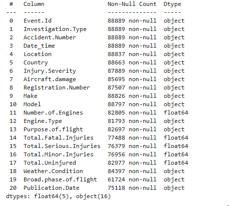

<h1>1.0Mitigating Critical Risks in New Aviation Ventures</h1>

<h3>1.1:Project Goals-</h3>

This project analyzes the Kind of Aircraft Makes and model with relation to the purpose of flights and the number of engines. This shows case the fuel consumptions and the budget allocation to each make. Also, we are able to see from timelines the make type and the number of engines involved in historic Accidents.
In weather forecasting 70 % of the flights were not affected with more than 2 engines
Globally, 90% of Aviation industries uses one common of engine type of aircraft

<h3>1.2:Methodology</h3>

Some of the analytical means used are through the correlation of the variables
Drawing of the trend lines to tell us the next expectations
Plotting of the bar graphs to the relationships and geographical mappings

<h3>1.3:Key Outcomes</h3>

Aircrafts with the lowest number of engines were highly affected by weather and the number of fatal accidents were very high
Aircraft with more than one engine were highly used

<h2>2.0 <b>Business Understanding</b> </h2>

Main aim of the project is to identify the potential risks of aircraft and  determining which aircraft are the lowest risk for the company to start this new business endeavor
<h3><b>2.1-Business Objective</b></h3>
<ol>
  <li>Identifying Which customer segments are most profitable with relation to the aircraft make</li>
  <li>looking up to which routes are most affected by delays?</li>
  <li>Understanding which aircraft Make is used most in the flights</li>
  <li>Analyzing which aircraft make and engine type had the highest and lowest incidence of accidents</li>
  <li>Which geographical route has the highest number of flight accidents</li>
  <li>Finding the relationships between the number of aircraft engines and the number of accidents</li>
  <li>Identifying the Financial Risks in Fuel consumption with the number of passengers and the no. engines</li>
  <li>With relation to the time lines trend, in the advancement of technology , what is the accidents trends with relation to the new make and models of aircraft in the market</li>
</ol>
<h3><b>2.2-Stake Holders</b></h3>
<ol>
  <li><b>Project sponsor:</b> Champions the project and ensure it alligns with company goals</li>
  <li><b>Project Sponsor:</b> Responsible for planning, executing and delivering the project </li>
  <li><b>Airline Customers:</b> Impacted by project outcomes, such us the new aircraft deliveries </li>
  <li><b>Flight Operation Teams:</b> they are impacted with the project outcomes and the make of the aircraft </li>
  <li><b>Safety and Risk Management Teams:</b> Responsible for identifying and mitigating risks to ensure safe operations</li>
  <li><b>Finance and accounting Team:</b> Responsible for managing project budget and financial reporting </li>
</ol>

<h2>3.0-Data Understanding</h2>

<b>3.1-Data source:</b>The dataset was obtained from the <a href="https://www.kaggle.com/">Kaggle Website</a>  and includes records of flights between 1998 and 2023.

<h3><b>3.2-Data Structure</b>:</h3>

Understanding the Data Stucture , we need to check at the data types the kind of column names and rows we have, from our Image

From our data Information, we are able to see the kind of data set and types  we have,  on the column names we have the names and on the Dtype we have the data types Objects are much more than the floats 

